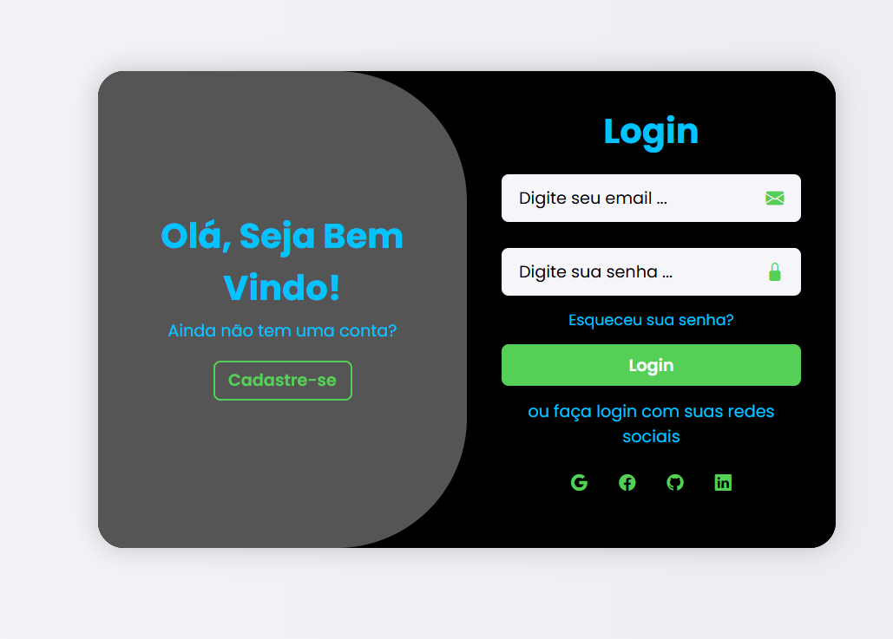
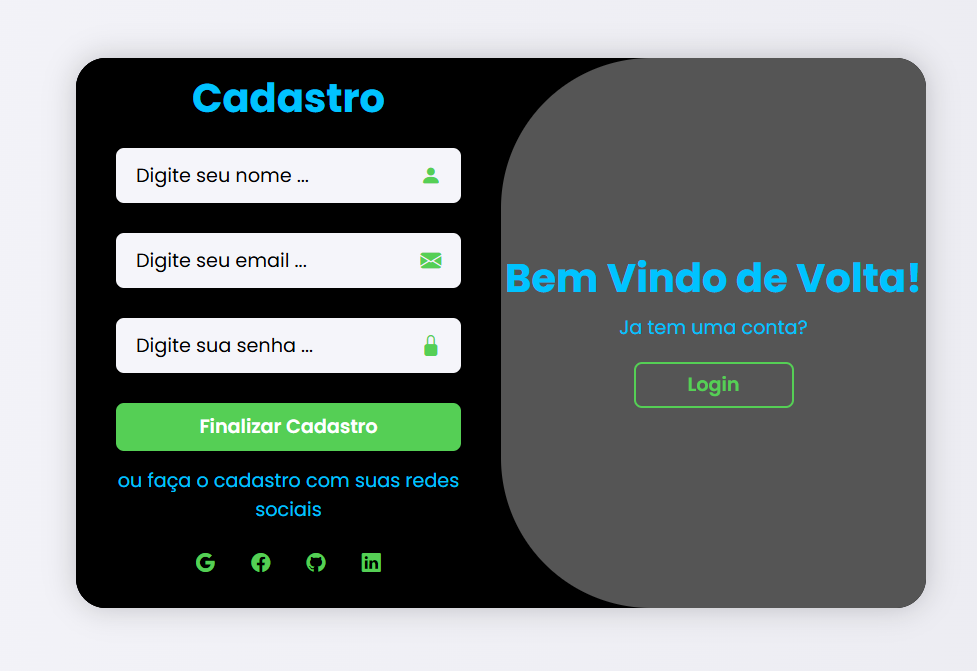

# 🔐 Página de Login e Cadastro Animada

Este projeto foi desenvolvido com o objetivo de praticar HTML, CSS e JavaScript, explorando transições visuais, responsividade e interatividade em uma interface moderna de login e cadastro.

## 🌟 Funcionalidades

- Interface moderna e responsiva com design minimalista.
- Efeitos de transição entre login e cadastro.
- Ícones sociais para login com redes (Google, Facebook, GitHub, LinkedIn).
- Validação básica de campos (requerimento de preenchimento).
- Layout adaptável para diferentes tamanhos de tela (mobile e desktop).

## 📸 Preview


 


> A interface exibe duas seções principais:
> - **Login**: para usuários já registrados.
> - **Cadastro**: para novos usuários.

## 🛠️ Tecnologias Utilizadas

- **HTML5**: Estrutura semântica da página.
- **CSS3**: Estilização com responsividade e animações.
- **JavaScript Vanilla**: Controle da lógica de alternância entre telas.
- **Bootstrap Icons**: Ícones modernos e funcionais.

## 🚀 Clone o repositório:
   ```bash
   git clone https://github.com/seu-usuario/nome-do-repo.git
```
## 🎨 Destaques do Layout
- Transições Suaves: Ao clicar nos botões “Login” ou “Cadastre-se”, as caixas deslizam com efeito fluido.

- Cores e Contrastes: Combinação de preto, verde e azul para destacar os elementos.

- Responsividade Total: Compatível com diferentes tamanhos de tela, adaptando o layout em dispositivos móveis.

## 🎨 Paleta de Cores Utilizada

A escolha das cores foi pensada para criar uma interface que transmitisse **modernidade, confiança e clareza visual**, fundamentais em páginas de login e cadastro. Abaixo estão os destaques:

| Cor         | Aplicação                        | Hex       | RGB                  | Significado Transmitido               |
|-------------|----------------------------------|-----------|----------------------|----------------------------------------|
| 🖤 Preto     | Fundo principal da interface     | `#000000` | `rgb(0, 0, 0)`       | Profundidade, foco e modernidade       |
| 💚 Verde     | Botões, ícones sociais, bordas   | `#55cf55` | `rgb(85, 207, 85)`   | Ação, positividade e confirmação       |
| 💙 Azul ciano| Textos, links e destaques        | `#00c3ff` | `rgb(0, 195, 255)`   | Confiança, tecnologia e dinamismo      |
| ⚪ Cinza claro| Plano de fundo e campos de input| `#f5f5fa` | `rgb(245, 245, 250)` | Neutralidade, leveza e sofisticação    |
| ⚫ Cinza escuro| Painel de transição             | `#555555` | `rgb(85, 85, 85)`    | Estabilidade, contraste e equilíbrio   |

Cada tom tem um papel específico no design, contribuindo para uma **experiência visual fluida e intuitiva** para o usuário.


## 💡 Aprendizados
- Durante o desenvolvimento deste projeto, pratiquei:

- Estruturação eficiente com HTML e semântica.

- Utilização de animações CSS e media queries.

- Manipulação de classes via DOM com JavaScript.

- ntegração de ícones externos com Bootstrap Icons.

## 📁 Estrutura do Projeto
```
📦 projeto-login
├── index.html       # Estrutura da página
├── style.css        # Estilização e animações
└── script.js        # Lógica de transição entre telas
```

## 📌 Observações
- Este projeto não possui backend. As funcionalidades de login e cadastro são apenas visuais.

- Pode ser usado como base para projetos futuros que incluam autenticação real.